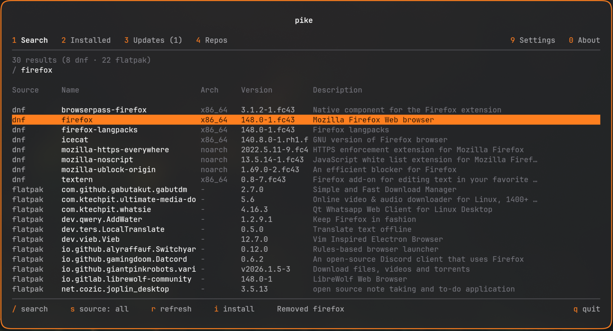

# Pike

Unified package manager for Linux - wraps **dnf**, **apt**, and **flatpak** into a single CLI + interactive TUI. Built for tiling WM users (Hyprland / Sway) on Fedora, Debian, Ubuntu, and derivatives.

- Install, remove, search, and update across dnf, apt, and flatpak with one command
- Background daemon with periodic update checks and desktop notifications
- Interactive TUI with 6 tabs: Search, Installed, Updates, Repos, Settings, About
- Waybar integration with push updates from daemon (no polling)
- Localization (English, Polish) with CLDR plural rules, configurable in TUI or config file
- Unix socket IPC, SQLite update cache, XDG-compliant paths



## Why pike?

- **vs topgrade** - topgrade is an updater only (runs `dnf upgrade` / `flatpak update`). No install/remove/search, no TUI, no daemon, no Waybar widget, no repo management. Pike is a full package manager.
- **vs GNOME Software / KDE Discover** - GUI apps tied to their desktop environment. Not keyboard-driven, not designed for tiling WM workflows, and GNOME Software can't manage dnf repos.
- **vs using dnf/apt + flatpak separately** - no unified search, no single install command, no combined update count in Waybar, no shared daemon. Multiple notification sources, multiple sets of commands to remember.
- **vs packagekit** - D-Bus abstraction layer with limited CLI. No TUI, no Waybar integration, no background daemon with push updates.

## Requirements

Requires at least one of **dnf**, **apt**, or **flatpak** on the system. dnf and flatpak are pre-installed on Fedora; apt is pre-installed on Debian and Ubuntu. Pike auto-detects available backends at startup.

The apt backend uses `apt-get`, `apt-cache`, and `dpkg-query` for maximum compatibility across Debian-based distributions.

> **Fedora Atomic / Silverblue:** Pike requires a mutable dnf system. Fedora Atomic desktops (Silverblue, Kinoite, Sericea, Onyx) are not currently supported - they use `rpm-ostree` instead of `dnf5`. Flatpak-only mode would work in theory, but is untested.

### Supported backends

| Feature | dnf (Fedora 41+) | apt (Debian/Ubuntu) | flatpak |
|---------|:-:|:-:|:-:|
| search, install, remove | yes | yes | yes |
| multi-package install/remove | yes | yes | yes |
| update (single, multi, all) | yes | yes | yes |
| check for updates | yes | yes | yes |
| list installed | yes | yes | yes |
| autoremove | yes | yes | yes |
| purge (remove config/data) | - | yes | yes |
| repo list | yes | yes | yes |
| repo add | repofile, copr, baseurl, rpm | ppa, baseurl | remote |
| repo enable/disable | yes | - | yes |
| repo remove | - | yes | yes |

The dnf backend requires `dnf5` (Fedora 41+). The apt backend uses `apt-get`, `apt-cache`, and `dpkg-query`, and supports both legacy `.list` and modern DEB822 `.sources` repo formats (Ubuntu 24.04+). Flatpak repo operations require a system D-Bus session.

## Install

### From GitHub release

```bash
curl -fsSL https://github.com/MichalWilk/pike/releases/latest/download/pike-linux-x86_64.tar.gz -o /tmp/pike-linux-x86_64.tar.gz
curl -fsSL https://github.com/MichalWilk/pike/releases/latest/download/pike-linux-x86_64.tar.gz.sha256 -o /tmp/pike-linux-x86_64.tar.gz.sha256
cd /tmp && sha256sum -c pike-linux-x86_64.tar.gz.sha256
sudo tar xzf /tmp/pike-linux-x86_64.tar.gz -C /usr/local/bin pike
```

### From source

Requires Rust 1.85+:

```bash
git clone https://github.com/MichalWilk/pike.git
cd pike
cargo install --path crates/pike-cli
```

## Setup

### 1. Start the daemon

The daemon checks for updates periodically and sends desktop notifications. Pick one method:

```bash
# systemd (recommended) -auto-starts on login, restarts on failure
cp contrib/pike-daemon.service ~/.config/systemd/user/
systemctl --user enable --now pike-daemon

# Hyprland autostart
# exec-once = pike daemon

# Sway autostart
# exec pike daemon

# Manual (foreground, for testing)
# pike daemon
```

### 2. Notification daemon

Tiling WMs don't ship a notification daemon -you need one for `notify-send` to work:

| Daemon | Install | Notes |
|--------|---------|-------|
| **dunst** | `sudo dnf install dunst` | Minimal, widely used |
| **mako** | `sudo dnf install mako` | Default for Sway |
| **swaync** | `sudo dnf install SwayNotificationCenter` | Has notification center panel |

If `notify-send` is missing: `sudo dnf install libnotify`.

### 3. Waybar widget (optional)

See [Waybar Integration](#waybar-integration) below.

## Usage

```bash
pike search firefox                # search across all enabled backends
pike install firefox               # auto-detect source
pike install firefox -S flatpak    # force source (dnf, apt, or flatpak)
pike install vim git curl          # install multiple packages
pike remove firefox
pike remove firefox --purge        # remove config files (apt) or app data (flatpak)
pike remove vim git curl           # remove multiple packages
pike update                        # update all packages
pike update -S dnf                 # update all dnf packages only
pike update bash                   # update single package
pike update bash vim               # update multiple packages
pike autoremove                    # remove orphaned deps & unused runtimes
pike check                         # check for updates (caches results)
pike check --notify                # check + notify if updates found
pike check --notify-always         # check + notify regardless of result
pike check --waybar                # check + output waybar JSON
pike list                          # list all installed packages
pike list --updates                # show cached updates
pike status                        # "3 updates (2 dnf · 1 flatpak)" (or apt, etc.)
pike status --waybar               # JSON for waybar custom module
pike status --notify               # send desktop notification if updates exist
pike status --notify-always        # send desktop notification regardless of result
pike daemon                        # run background daemon (periodic checks + notifications)
pike waybar                        # continuous waybar output (requires daemon)
pike tui                           # interactive terminal UI
```

**Source auto-detection:** when no `-S` flag is given, pike searches all enabled sources in parallel. If the package is found in exactly one source, that source is used. If found in multiple sources, pike returns an error asking you to specify with `-S dnf`, `-S apt`, or `-S flatpak`. There is no implicit priority between sources.

**GPG key import:** after a distribution upgrade or when a new repository is added, dnf may need to import new signing keys before it can refresh metadata. When run from a terminal, `pike check` detects the pending keys, lists them, and asks whether to import them (approval happens in dnf's own interactive prompt). When declined, or run non-interactively (daemon, `--waybar`, `--json`), pike never blocks: it skips the affected repositories and the daemon logs a reminder to run `pike check` in a terminal.

Most commands have short aliases: `s` (search), `i` (install), `rm` (remove), `up` (update), `ar` (autoremove), `ck` (check), `ls` (list), `st` (status), `ui` (tui).

### Repository management

```bash
pike repo list                           # list all repos/remotes
pike repo list -S flatpak                # filter by source
pike repo enable terra -S dnf
pike repo disable terra -S dnf
pike repo add flathub-beta https://flathub.org/beta-repo/flathub-beta.flatpakrepo -S flatpak
pike repo add _ https://example.com/repo.repo -S dnf              # .repo file (default for dnf)
pike repo add _ kwizart/fedy -S dnf -m copr                       # COPR
pike repo add myrepo https://example.com/repo -S dnf -m baseurl   # base URL with name
pike repo add _ https://example.com/pkg.rpm -S dnf -m rpm         # RPM package
pike repo add _ https://example.com/repo.repo -S dnf --repo-id custom-id  # custom repo ID
pike repo add _ ppa:user/repo -S apt -m ppa                       # PPA (via add-apt-repository)
pike repo add _ https://example.com/sources.list -S apt -m baseurl  # base URL (via add-apt-repository)
pike repo remove flathub-beta -S flatpak
```

`repo add` requires `--source` (`-S`) -source is never auto-detected. DNF supports four methods: `repofile` (default), `copr`, `baseurl`, `rpm` -select with `--method` (`-m`). For `repofile` and `baseurl`, use `--repo-id` to set a custom repository ID. Apt supports `ppa` (default) and `baseurl` methods, both using `add-apt-repository` under the hood.

Global flags: `--json` (machine-readable output), `--verbose` (debug logging).

## Interactive TUI

Launch with `pike tui` (or `pike ui`). Six tabs:

| Tab | Key | Features |
|-----|-----|----------|
| Search | `1` | `/` to type query, `i` install, `d` remove, `s` cycle source filter, `r` re-search |
| Installed | `2` | `/` to filter, `d` remove, `A` autoremove, `s` cycle source, `r` refresh |
| Updates | `3` | `/` to filter, `u` update selected, `U` update all, `s` cycle source, `r` refresh |
| Repos | `4` | `/` to filter, `e` toggle enable/disable, `a` add (wizard), `d` delete, `s` cycle source, `r` refresh |
| Settings | `9` | `e` toggle option (auto-saves) |
| About | `0` | Project info, `Enter` to open repo URL |

Navigation: `j`/`k` or arrows, `Tab`/`Shift+Tab` cycle tabs, mouse scroll/click, `q` quit.

The repo add wizard (`a` on Repos tab) guides through source selection, then method selection (for dnf: .repo file, COPR, base URL, RPM package), then shows method-specific input fields.

## Configuration

`~/.config/pike/config.toml` -created with defaults on first run, editable manually or via TUI Settings tab. Sources are auto-detected: each is enabled only if its binary (`dnf`, `apt-get`, `flatpak`) is found on the system.

```toml
[general]
# privilege_escalation = "auto"  # "auto", "sudo", "pkexec", or "doas"

[sources]
# dnf = true
# apt = true
# flatpak = true

[display]
# language = "auto"  # "auto", "en", or "pl"

[display.architectures]
# dnf = ["x86_64", "noarch"]
# apt = ["amd64"]

[logging]
# file = true

[daemon]
# interval = 600    # seconds between update checks (minimum: 10)
# notify = true     # desktop notifications when updates are found
```

See [`config.example.toml`](config.example.toml) for full documentation. Changes to daemon settings are propagated to a running daemon immediately.

### Privilege escalation

dnf and apt operations (`install`, `remove`, `update`, `autoremove`, repo management) require root. Pike escalates privileges using a configurable method:

| Method | Behavior |
|--------|----------|
| `auto` (default) | Uses `sudo` when a TTY is available (terminal). When no TTY is detected (e.g. Waybar on-click, scripts), falls back to `pkexec` (polkit GUI dialog). Errors if neither is available. |
| `sudo` | Always uses `sudo`. Fails with a clear error when no TTY is available. |
| `pkexec` | Always uses `pkexec` (polkit GUI password prompt). Works without a TTY. |
| `doas` | Always uses `doas` (OpenBSD sudo alternative). Fails without a TTY. |

flatpak operations run as the current user and do not require privilege escalation.

Set in config:

```toml
[general]
privilege_escalation = "auto"
```

**Waybar on-click:** The default `auto` mode detects no TTY in Waybar's `on-click` handler and uses `pkexec` automatically. If you prefer a specific method, set it explicitly.

## Files

Pike follows [XDG Base Directory](https://specifications.freedesktop.org/basedir-spec/latest/) conventions. All directories are created automatically on first run.

| File | Default path | Purpose |
|------|-------------|---------|
| Config | `~/.config/pike/config.toml` | See [Configuration](#configuration) |
| Database | `~/.local/share/pike/pike.db` | SQLite cache of available updates (written by `pike check`, read by `pike status`) |
| Log | `~/.local/state/pike/pike.log` | Application log (append-only, `pike=info` level) |
| Socket | `/run/user/$UID/pike.sock` | Unix socket for daemon IPC (created by `pike daemon`) |

- **Database** -enables instant `pike status --waybar` without shelling out to dnf/flatpak.
- **Log** -only written when `[logging] file = true` in config (the default). Falls back to `~/.local/share/pike/pike.log` then `/tmp/pike/pike.log` if the state directory is unavailable.
- **Socket** -cleaned up automatically on daemon shutdown. CLI commands transparently fall back if socket is missing.

All paths respect `$XDG_CONFIG_HOME`, `$XDG_DATA_HOME`, and `$XDG_STATE_HOME` when set.

## Daemon

The daemon periodically checks for updates and sends desktop notifications via `notify-send`. When running, CLI commands (`pike status --waybar`, `pike check`) connect via Unix socket for instant responses instead of spawning subprocesses. See [Setup](#setup) for installation.

The daemon is the single source of notifications, eliminating duplicates that can occur when waybar's interval and on-click both trigger checks. If the daemon is not running, all CLI commands fall back to direct behavior (subprocess spawning + SQLite cache).

Configure the check interval and notifications in the `[daemon]` section -see [Configuration](#configuration).

## Waybar Integration

`pike waybar` connects to the daemon and continuously outputs JSON in the [waybar custom module](https://github.com/Alexays/Waybar/wiki/Module:-Custom) format. The widget updates automatically when the daemon finishes a check -no polling, no signals.

### Waybar config

Add to `~/.config/waybar/config`:

```jsonc
"custom/pike": {
    "exec": "pike waybar",
    "return-type": "json",
    "on-click": "pike check --notify-always",
    "on-click-right": "$TERMINAL -e pike tui --tab updates",
    "format": "{}"
}
```

- **exec** -persistent process, receives push updates from daemon
- **Left click** -tells daemon to check now + always notify
- **Right click** -opens the TUI on the Updates tab

### Waybar style

Add to `~/.config/waybar/style.css`:

```css
#custom-pike {
    padding: 0 8px;
}

#custom-pike.has-updates {
    color: #e5c76b;  /* warm yellow - attention */
}

#custom-pike.up-to-date {
    color: #8a8f9a;  /* muted gray - all good */
}
```

### Output format

When updates are available:

```json
{"text":"󰏗  3","tooltip":" dnf - 2 updates\n  bash 5.2.37 → 5.2.38\n  vim-enhanced 9.1.800 → 9.1.900\n\n flatpak - 1 update\n  org.mozilla.firefox ? → 137.0\n\nLast checked: 2026-03-05 14:30","class":"has-updates"}
```

When everything is up to date:

```json
{"text":"󰄬","tooltip":"All up to date\nLast checked: 2026-03-05 14:30","class":"up-to-date"}
```

Icons are auto-detected via `fc-list`: [Nerd Font](https://www.nerdfonts.com/) glyphs when available, Unicode fallback otherwise.

### Periodic update checks

With the daemon running, updates are checked automatically (configurable via `[daemon] interval` -see [Configuration](#configuration)). The `pike waybar` process receives push updates from the daemon -no polling needed.

### Hyprland keybind

Optionally bind a key to open the TUI directly:

```ini
# ~/.config/hypr/hyprland.conf
bind = $mainMod, P, exec, $terminal --class pike-tui -e pike tui
windowrulev2 = float, class:(pike-tui)
windowrulev2 = size 900 600, class:(pike-tui)
```

## Localization

Pike uses `rust-i18n` for internationalization. All user-facing strings are loaded from TOML locale files at compile time.

Ships with English and Polish. Set the language in `config.toml` or cycle through options in the TUI Settings tab:

```toml
[display]
language = "auto"  # "auto", "en", or "pl"
```

`"auto"` detects from `LANG` / `LC_ALL` environment variables. To add a new language, copy `crates/pike-cli/locales/en.toml` to `<lang>.toml` and translate the values.

**Not translated** (by design): clap `--help` text, `pike-core` error messages (library crate, no i18n dependency), waybar JSON keys/classes (machine-readable).

## Development

Requires Rust 1.85+. Optionally install [just](https://github.com/casey/just) for convenience recipes.

```bash
just check               # fmt + clippy + unit tests
just build                # debug build
just release              # release build
```

### Integration tests

Integration tests run pike inside Podman containers (Fedora for dnf, Ubuntu for apt). Each backend is tested for search, list, check, status, waybar, repo management, install/remove (single and multi-package), purge, update (single, multi, all), and autoremove.

```bash
just test-integration     # run all backends (dnf + apt)
just test-dnf             # run dnf tests only
just test-apt             # run apt tests only
```

Requires [Podman](https://podman.io/) (or Docker via `CONTAINER_RUNTIME=docker just test-integration`).

## Roadmap

### Coming next

- **mise backend** - global runtime management (node, python, go) via `mise use -g`
- **Source priority config** - per-package install preference (`[install.priority]` and `[install.prefer]` in config.toml), interactive prompt on first conflict with option to save choice

### Considering

- rpm-ostree / Fedora Atomic support
- pipx backend
- Homebrew backend

### Won't do

- **Snap support** - systemd socket dependency conflicts with tiling WM setups, low Fedora adoption
- **Per-project versioning via mise** - out of scope, use mise directly for .mise.toml workflows

